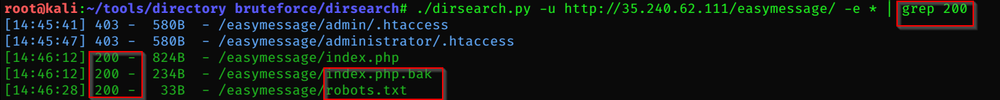

Challenge URL
===============
[Easy Message](https://cybertalents.com/challenges/web/easy-message )

Challenge Description
===============
I Have a Message for you

Level:
===============
easy

Points:
===============
50

Tools:
===============
1. burp suite
2. dirsearch

___

So we should find This Message.

we should have a username and password to login.
# steps:

1. so we will search in *source code* , *cookies* , *use dev tools* for any username or password **we didn't find anything**
2. see Request and Response using burp suite **we didn't find anything**
3. try to detect sql injection vuln **there aren't any sql injection here**
4. so we will Brute forec directory using [dirsearch tool](https://github.com/maurosoria/dirsearch)
5. 

