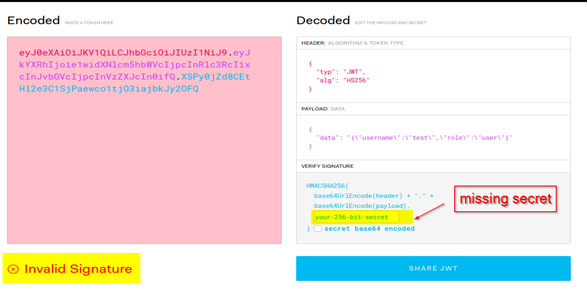
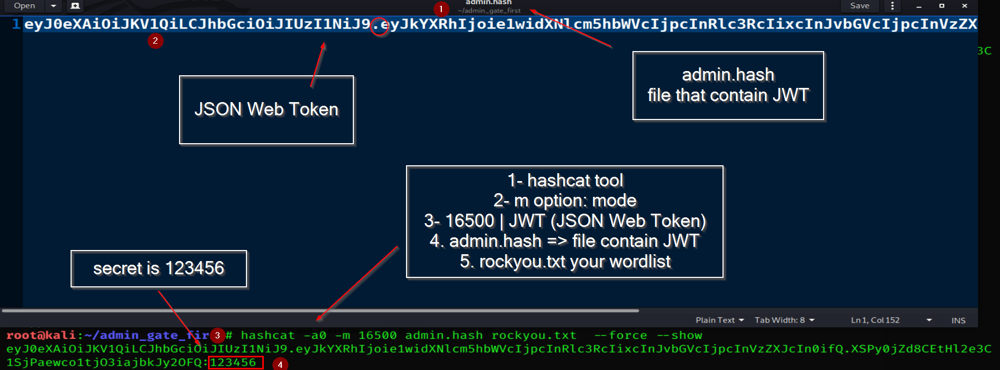
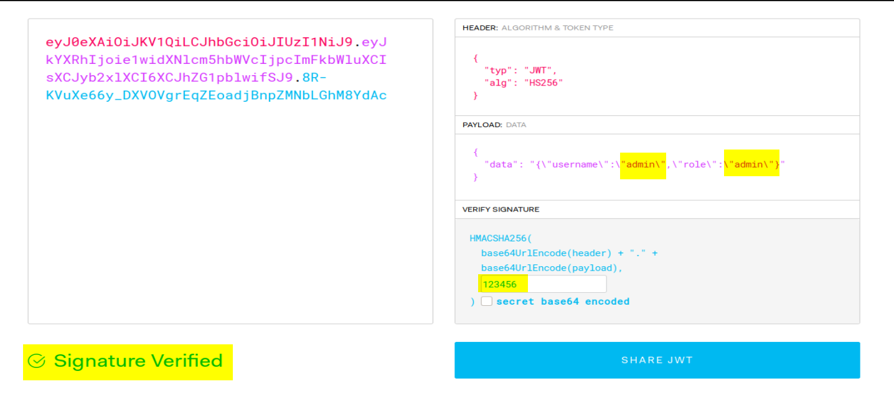

Thanks to my friend totaly Who solve the challange: [Mohamed Elawadly](https://twitter.com/Elawadly77)
===============

Challenge URL
===============
[ admin gate first](https://cybertalents.com/challenges/web/admin-gate-first)

Challenge Description
===============
Flag is safe in the admin account info

Level:
===============
medium

Points:
===============
100

Requirements: 
===============
1. Knowledge about JWT and How to Crack it

Tools:
===============
1. hashcat
2. [JWT.IO](https://jwt.io/)

___

From our hint you should be an admin to get the Flag
# steps:
1. first thing , you will notice login Form with known credentials User:test and Pass:test
2. try to login 
3. 
4. when you login see Your cookie using cookie editor or burp
5. you will notice there are auth cookie and it's Value is JWT
6. JWT is json web token if you don't know it read [here](https://jwt.io/introduction/)

7. after you read this article you should know that JWT consist of three parts separated by dots (.), which are":

    1. Header
    2. Payload 
    3. Signature
    
8. in our challange you will notice these three parts separated by dots (.)

9.

10. i will use [JWT.IO](https://jwt.io/) to manipulate this JWT

11. but my JWT is missing **secret** 

12. 

13. so i should crack the Token to get the secret 

14. you should to know the importance of the secret

15. 

14. after searching i found that i should using [hashcat](https://hashcat.net/hashcat/)

15. after using hashcat -h on linux

16. i decided to write this command to Brute-force the secret

17. 

18. after that you should put you secret and manipulate username and role like this:

19. 

20. to get the flag put your new JWT in burp request after HEADER **Authorization: BeareR**  like this to get the flag in response 

21. 
